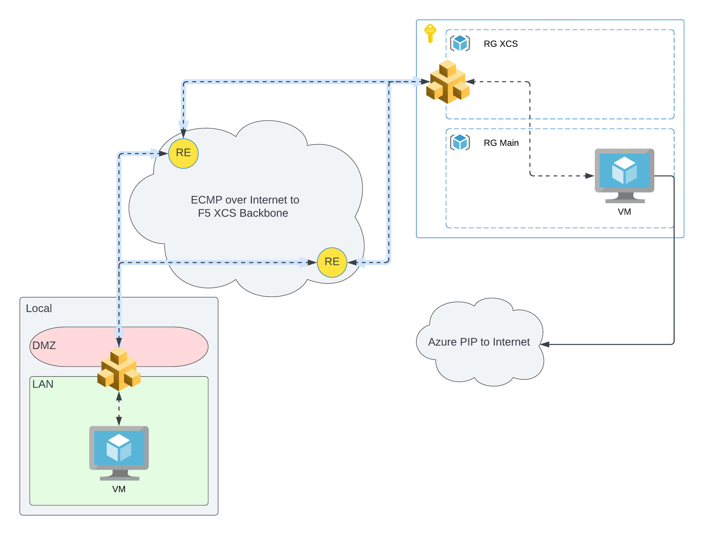

# f5xcs-mcn-tunnel-azure

Automated deployment of MCN Site for OpenConnect between CEs

## Introduction

This template is designed around the concept of using a VM in a Cloud Service Provider (Azure in this use-case) as an VPN endpoint that will automatically spool up with all of the networking built and attached to allow a client on a local endpoint to connect accross the ADN for egress.



## Deployment

### Local

To get everything set up, first deploy a Customer Edge Site in your local datacenter.  Guidance on that can be found here:  [https://docs.cloud.f5.com/docs/how-to/site-management](https://docs.cloud.f5.com/docs/how-to/site-management)

Once you have your local customer edge site deployed, then create a fleet.  Guidance on that can be found here:  [https://docs.cloud.f5.com/docs/how-to/fleets-vsites/create-a-fleet](https://docs.cloud.f5.com/docs/how-to/fleets-vsites/create-a-fleet)

An important aspect of this scenario is making sure to have your virtual networks and network connectors configured correctly.  When you do, any remote site you spool up that is connected to your global networks will automatically be added to your available routes.  For this use-case, we want to use Direct, Site Local Inside to a Global Network. SNAT is fine, but I dont want any traffic egressing from local datacenter and SNAT enables this path.

Virtual Networks [https://docs.cloud.f5.com/docs/how-to/networking/virtual-networks](https://docs.cloud.f5.com/docs/how-to/networking/virtual-networks)
Network Connectors [https://docs.cloud.f5.com/docs/how-to/networking/network-connectors](https://docs.cloud.f5.com/docs/how-to/networking/network-connectors)

You will want to have a vm of your choice with a client compatible with OpenConnect.  The instructions provided later are for a Linux VM, but any client VM is fine as long as you follow the instructions later for your particular system.

### Remote

To get our remote site spun up, its actually pretty simple, since its covered in the provided terraform.

First we need to prep, an example script will log in to azure and map subscription and tenant, create an SPN and map the AppID and Secret so we can create a Cloud Credential:

```bash
. ./prep.sh
```

Once everything is mapped with the prep script, ensure that you have either updated the variables.tf, created an override or tfvars with your desired settings and then:

```bash
$terraform init
(optional)$ terraform plan
$terraform apply
```

### Local Part II

Once terraform completes, you will have a couple commands to run from output.  As mentioned previously these are targeted for a linux VM, but you can port to Windows or Mac pretty easily. These will map the remote hostname with the (trusted) LetsEncrypt certificate verified domain, and open a vpn connection:

```bash
Apply complete! Resources: 30 added, 0 changed, 0 destroyed.

Outputs:

auto_tag = {
  "resource_group" = "<random_hash>_main_rg"
}
deployment_info = {
  "deploymentId" = "<random_hash>"
  "instances" = [
    {
      "admin_password" = "<random_hash>"
      "admin_username" = "xadmin"
      "azure_resource_group" = "<random_hash>_main_rg"
      "connect" = "echo -n <random_hash> | sudo openconnect -b domain.region.cloudapp.azure.com -u vpnuser --passwd-on-stdin"
      "host_mapping" = "sudo -- sh -c 'echo <app_address>   domain.region.cloudapp.azure.com.cloudapp.azure.com >> /etc/hosts'"
    },
  ]
}
```
